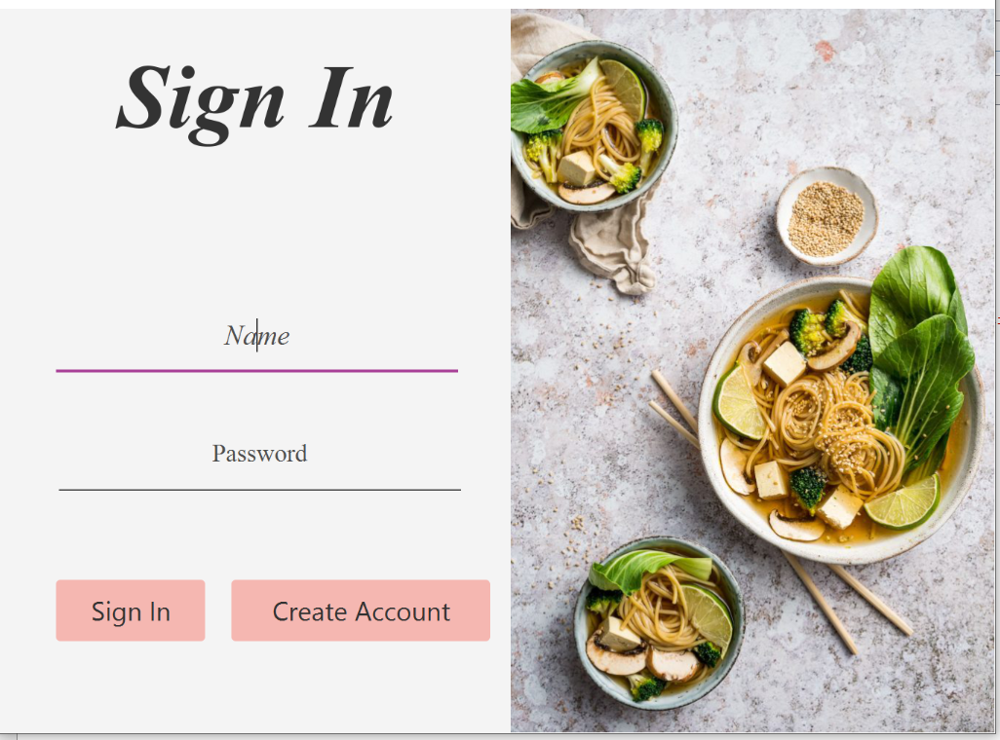
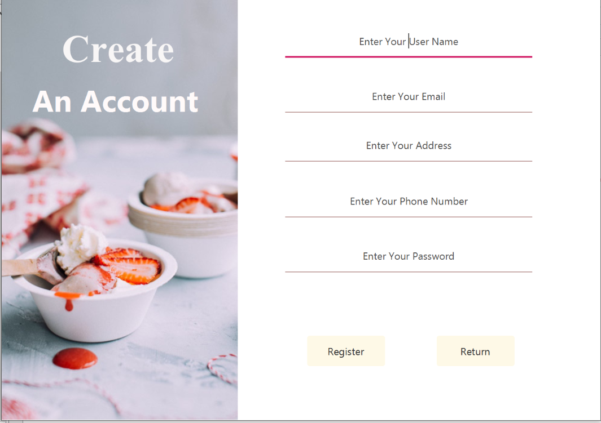
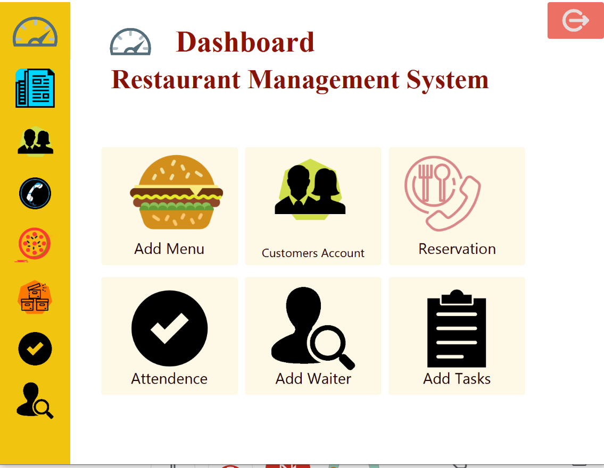
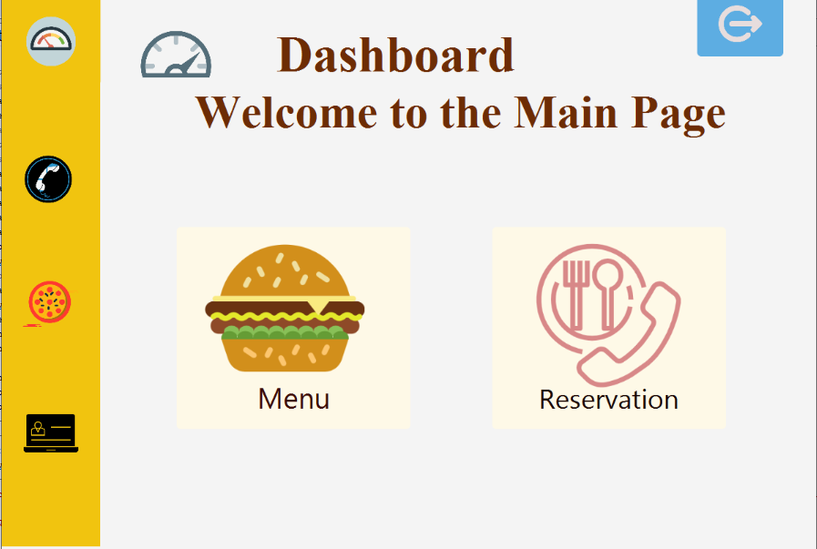
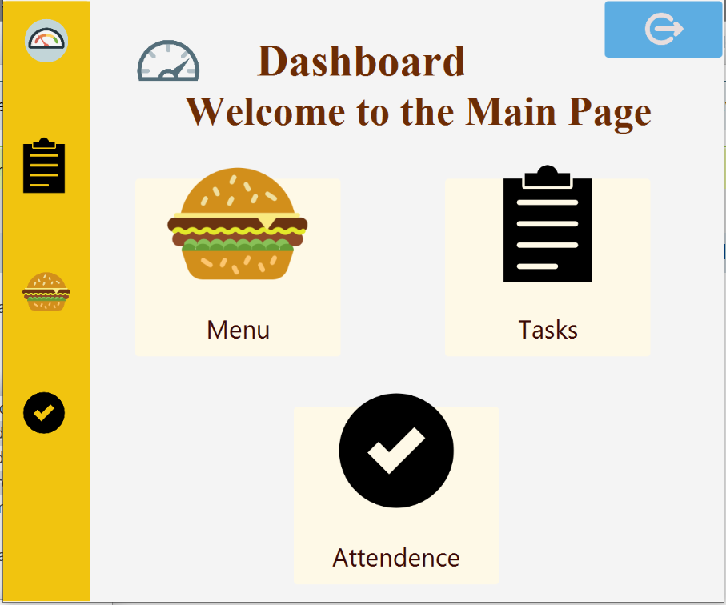

# Resturant Management System

This project focuses on a resturant management system, and it follows the Agile Scrum  programming methodology. 
There are 3 roles in this project namely Admin, Customer, and Waiter.
There are seperate windows for each of these roles where they can access the required functionality. The admin should be able to register waiters, see the reserved tables, interact with the menu, see the list of registered customers, take waiters' attendance, interact with the raw materials list, and assign waiters to reserved tables after logging in to the system.
Similarly, a customer should be able to sign up, log in to the system, access the menu, reserve a table, select the date and time of reservation, and enter the number of guests per table.
A waiter should be able to access the menu, view his/her attendance checked by the user, view the tables he/ she is assigned to, and select done when a task is done.
This system will be launched as different executable versions for different roles.

## Roles

**Product Owner:**
Madina Fazli

**Scrum Master:**
Muzhda Noorzad

**Developers:**
- Manizha Nizami
- Maihan Naimi
- Ahamad Seayar Sroosh
- Khalid Khan

## Languages and Tools

**Java Programming Language**

**NetBeans IDE 8.2**

**Scene Builder**

## System Interface

**Sign In Page**

**Sign Up Page**

**Admin Main Window**

**Customer Main Window**

**Waiter Main Window**

